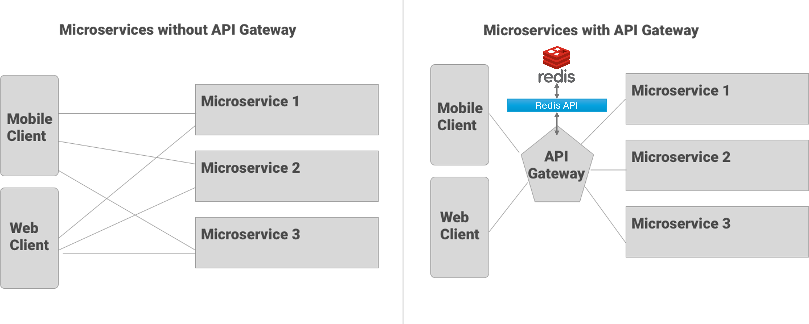
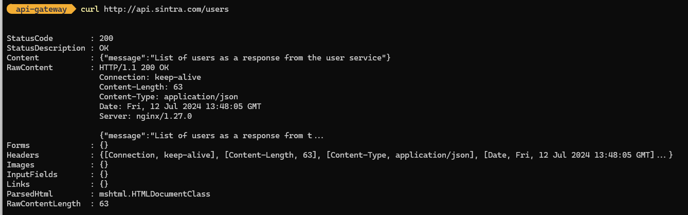
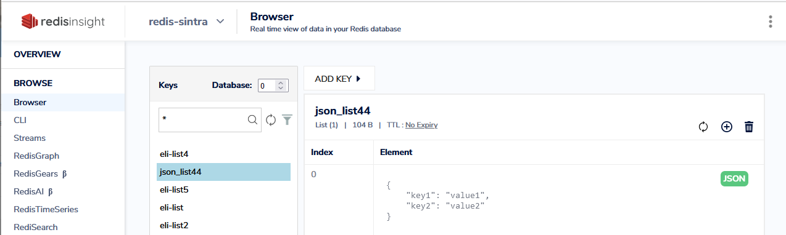

# API GATEWAY EXAMPLE



<p>
An API gateway is a centralized service that acts as an entry point for all client requests to a system's backend services. It serves several crucial functions:

**Routing:** It directs client requests to the appropriate backend service based on the request's path, headers, or other parameters. For example, requests for user data might be routed to a user service, while requests for product information might go to an inventory service.

**Protocol Translation:** It can translate between different protocols. For instance, it can accept HTTPS requests from clients and forward them as plain HTTP to backend services that might not support HTTPS natively.

**Aggregation:** It can aggregate multiple requests into a single request to reduce the number of round-trips between the client and the server. This helps improve efficiency and performance.

**Security:** It handles various security-related tasks, such as authentication (ensuring that clients are who they claim to be) and authorization (determining whether clients are allowed to access a particular resource).

**Monitoring and Analytics:** It can monitor the traffic flowing through it and provide analytics on usage patterns, response times, and other metrics. This information is valuable for debugging, capacity planning, and improving overall system performance.

**Rate Limiting:** It can enforce rate limits to protect backend services from being overwhelmed by too many requests from clients.

**Logging and Tracing:** It logs requests and their responses, making it easier to debug issues and trace the flow of requests through the system.


</p>


## usage

```
#git clone the repository and then navigate to the folder
docker compose up --build -d
```

```
#OPTIONAL: edit the hosts file so that you can use api.sintra.com/{endpoint} for your calls
#RUN with elevated priveleges

python edit-hosts.py
```

## test with curl
```
# w/curl from the command line
curl http://localhost/users

#OR

curl http://api.sintra.com/users
```

Output should look like below if using windows. 


## test with python

```
# run the test-endpoints.py file
python3 test-endpoints.py
```


## Documentation
<p>Each service has a /docs endpoint that will send you to swagger documentation along with data schemas:</p>
http://localhost/redis/docs    <br>
http://localhost/users/docs    <br>
http://localhost/products/docs <br>

<br> OR <br> 

if you made adjustments to your /etc/hosts manually or with the **edit-hosts.py** file:<br> 
http://api.sintra.com/redis/docs    <br>
http://api.sintra.com/users/docs    <br>
http://api.sintra.com/products/docs <br>


**Example:** After running the containers with the appropriate compose command for redis documentation, open a browser to http://localhost/redis/docs the page should look similiar to the image below. 


**Example:** You can open any of the endpoints using the drop down and get more detail information.


## FastAPI Redis CRUD API

## API Endpoints

### Test Redis Connection

Tests the connection to the Redis server.

**HTTP Method:** `GET`

**URL:** `/redis/`

**Example:**

```
curl -X GET "http://127.0.0.1/redis/"

```


---

### Create or Update a Key-Value Pair

Creates or updates a key-value pair in Redis.

**HTTP Method:** `POST`

**URL:** `/redis/create_item/`

**Request Body:** JSON with `key` and `value` fields.

**Example:**
```json
{
    "key": "mykey",
    "value": "myvalue"
}
```

**Example** `curl` command:

```
curl -X POST "http://127.0.0.1/redis/create_item/" -H "Content-Type: application/json" -d '{
    "key": "mykey",
    "value": "myvalue"
}'

```

Get a Key-Value Pair

Retrieves a value from Redis based on a key.

HTTP Method: POST

URL: `/redis/get_item/`

Request Body: JSON with key field.


```
{
    "key": "mykey"
}

```

**Example** `curl` Command:
```
curl -X POST "http://127.0.0.1/redis/get_item/" -H "Content-Type: application/json" -d '{
    "key": "mykey"
}'

```


Create a List

Creates a list in Redis with specified items.

HTTP Method: POST

URL: `/redis/create_list/`

Request Body: JSON with list_name and payload fields. payload should be an object containing list items.


**Example:**
```
{
    "list_name": "mylist",
    "payload": {
        "item1": "value1",
        "item2": "value2"
    }
}

```

**Example** `curl` command:

```
curl -X POST "http://127.0.0.1/redis/create_list/" -H "Content-Type: application/json" -d '{
    "list_name": "mylist",
    "payload": {
        "item1": "value1",
        "item2": "value2"
    }
}'

```


Read a List

Reads all items from a list in Redis.

HTTP Method: POST

URL: `/redis/read_list/`

Request Body: JSON with listname field.


Example:

```
{
    "listname": "mylist"
}

```

**Example** `curl` command:
```
curl -X POST "http://127.0.0.1/redis/read_list/" -H "Content-Type: application/json" -d '{
    "listname": "mylist"
}'

```

Create or Update TLE Data

Stores or updates TLE (Two-Line Element) data for a satellite in Redis. Uses Hubble Telescope as example.


HTTP Method: POST

URL: `/redis/tle/`

Request Body: JSON with satellite_name, tle1, and tle2 fields.


Example:

```
{
    "satellite_name": "Hubble Space Telescope",
    "tle1": "1 20580U 90037B   20153.28845139  .00000111  00000-0  00000+0 0  9993",
    "tle2": "2 20580  28.4694 327.5692 0002748 336.7313  23.2995 15.09280881431826"
}

```

**Example** `curl`command:
```
curl -X POST "http://127.0.0.1/redis/tle/" -H "Content-Type: application/json" -d '{
    "satellite_name": "Hubble Space Telescope",
    "tle1": "1 20580U 90037B   20153.28845139  .00000111  00000-0  00000+0 0  9993",
    "tle2": "2 20580  28.4694 327.5692 0002748 336.7313  23.2995 15.09280881431826"
}'

```


Get TLE Data by Satellite Name

Retrieves TLE data for a satellite by its name from Redis.

HTTP Method: GET

URL: `/redis/tle/{satellite_name}`

Example:
```
curl -X GET "http://127.0.0.1/redis/tle/Hubble%20Space%20Telescope"

```

Delete TLE Data by Satellite Name

Deletes TLE data for a satellite by its name from Redis.

HTTP Method: DELETE

URL: `/redis/tle/{satellite_name}`

Example:

```
curl -X DELETE "http://127.0.0.1/redis/tle/Hubble%20Space%20Telescope"

```

## Sample Payloads

**TLE Data**
```
{
    "satellite_name": "Hubble Space Telescope",
    "tle1": "1 20580U 90037B   20153.28845139  .00000111  00000-0  00000+0 0  9993",
    "tle2": "2 20580  28.4694 327.5692 0002748 336.7313  23.2995 15.09280881431826"
}

```
If you want to test all the tle endpoints run the test_tle.py file
```
#test all the tle endpoints
python redis_crud_api/test_tle.py
```

Expected Output <br>


## RedisInsights
<p>
Get the internal ip of the redis cache so you can use it in the UI with IP:PORT default port is <strong>6379</strong>
</p>

1. For the RedisInsights UI, open webrowser to localhost:8003

```
docker inspect -f '{{range .NetworkSettings.Networks}}{{.IPAddress}}{{end}}' redis-sintra
```


# Questions
<br>


